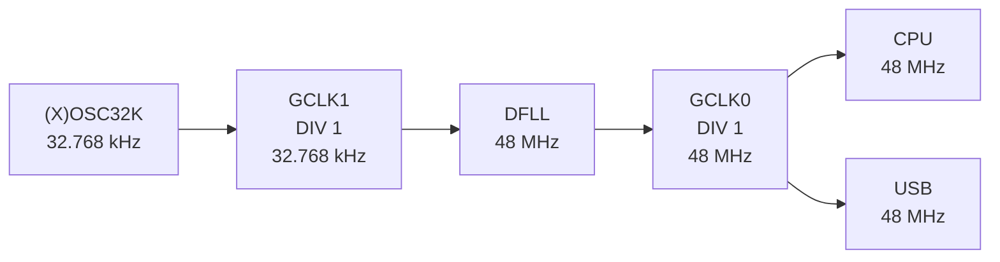
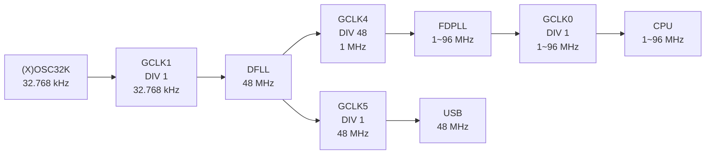
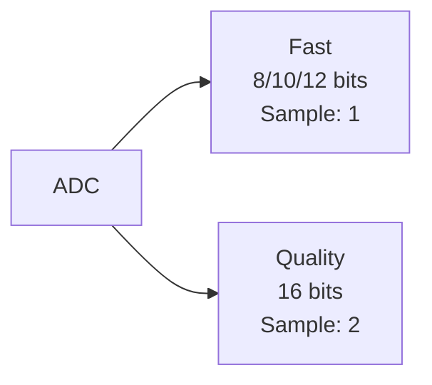

# **Arduino M0 Tweak**

Bring out hardware performance of SAMD21 such as overclock.
Easily performance tweak such as CPU overclocking, ADC acceleration, etc...

# Details
**!!CAUTION!! Overclocking should be performed at your own risk after fully understanding risk.**
**I take no responsibility if MCU burn or brick.**

I tried simple serialport communication program on my board ([Feather M0](https://www.adafruit.com/product/2772)) and it worked up to 78 MHz, but when set it to 80 MHz serialport connection broke.

If you overclock using this library, frequency dependent functions such as `delay()` and `millis()` will not work properly.
I plan to provide workaround for this at later.

## Specification
First, ATSAM series clock supply system is divided into 3 stages.

1. Clock Source
2. Clock Generator
3. Peripherals

### Clock Source
Consists of an oscillator and Locked-Loop.
There are total of 7 clock sources.

To operate DFLL and FDPLL, must be input clock from crystal oscillator or clock generator.

|Source|Frequency|In/Ex|Details|
|:--|:--|:--|:--|
|OSC32K|32.768 KHz|Internal|RC oscillator|
|OSCULP32K|32.768 KHz|Internal|RC oscillator, ultra low power|
|OSC8M|8 MHz|Internal|RC oscillator|
|XOSC32K|32.768 KHz|External|Crystal oscillator|
|XOSC|0.4~32 MHz|External|Crystal oscillator|
|DFLL|48 MHz|Internal|FLL, Must be input clock|
|FDPLL|0~96 MHz|Internal|PLL, Must be input clock|

### Clock Generator
Adjust and supply clock such as frequency division and duty ratio stabilization.
There are total of 8 clock generators and each clock generator has no functional difference.

Some of 8 clock generators are preconfigured internal Arduino platform.

GCLK1 input is XOSC32K when using external oscillator and OSC32K when using internal oscillator.
This is specified primarily at compile time with `CRYSTALLESS` macro.

|Generator|Source|Divide|Frequency|Usage|
|:--|:--|:--|:--|:--|
|GCLK0|DFLL|1/1|48 MHz|CPU, USB, etc...|
|GCLK1|OSC32K / XOSC32K|1/1|32.768 kHz|DFLL|
|GCLK2|OSCULP32K|1/1|32.768 kHz|(WDT)|
|GCLK3|OSC8M|1/1|8 MHz|-|
|GCLK4|-|-|-|-|
|GCLK5|-|-|-|-|
|GCLK6|-|-|-|-|
|GCLK7|-|-|-|-|

### Peripherals
Components that actually use generated clock such as CPU, ADC, and SERCOM.

## Mechanism
Arduino SAMD21 normally uses DFLL to provide CPU clock via GCLK0.
So overclocking is possible by changing GCLK0 clock source from DFLL that fixed 48MHz to FDPLL that can any frequency up to 96MHz.
Input clock for FDPLL is preferably 1MHz and is generated by enabling GCLK4 which divides DFLL by 48.

But there's problem with this.

Most peripherals are typically configured to use GCLK0 fixed at 48MHz for stable operation.
Although changing GCLK0 clock source to FDPLL, clock supplied to peripheral will also fluctuate, resulting in unexpected malfunctions.

So, to solve this problem, enabled GCLK5 which uses DFLL just like GCLK0 before change.
When overclocking, recommended to change clock generator used by peripheral from GCLK0 to GCLK5.

This is especially essential for timing-sensitive peripherals such as USB.
(USB is already set to use GCLK5 in function.)

### Before
|Generator|Source|Divide|Frequency|Usage|
|:--|:--|:--|:--|:--|
|GCLK0|DFLL|1/1|48 MHz|CPU, USB, etc...|
|GCLK1|OSC32K / XOSC32K|1/1|32.768 kHz|DFLL|
|GCLK2|OSCULP32K|1/1|32.768 kHz|(WDT)|
|GCLK3|OSC8M|1/1|8 MHz|-|
|GCLK4|-|-|-|-|
|GCLK5|-|-|-|-|
|GCLK6|-|-|-|-|
|GCLK7|-|-|-|-|

### After
|Generator|Source|Divide|Frequency|Usage|
|:--|:--|:--|:--|:--|
|GCLK0|FDPLL|1/1|1~96 MHz|CPU, etc.|
|GCLK1|OSC32K / XOSC32K|1/1|32.768 kHz|DFLL|
|GCLK2|OSCULP32K|1/1|32.768 kHz|(WDT)|
|GCLK3|OSC8M|1/1|8 MHz|-|
|GCLK4|DFLL|1/48|1 MHz|FDPLL|
|GCLK5|DFLL|1/1|48 MHz|USB, timing-sensitive peripherals|
|GCLK6|-|-|-|-|
|GCLK7|-|-|-|-|

# ADC
Arduino SAMD21 ADC executes 10 bits sampling twice to improve accuracy and return average.
Also 31.5 clock waiting is inserted to each sample that stabilize sampling.

Sampling twice in one reading, so sampling speed is inevitably halved.
These are factors that slow ADC slower than other MCUs in many situations.

On the other hand, SAMD21 ADC resolution is 12 bits, but using average mode, resolution can be pseudo 16 bits.

So, remove waiting, and if resolution is 12 bits or less, it will be changed to output directly with sample one, and if 16 bits, it will be output averaged with sample twice.

# API
See [`arduino_m0_tweak.hpp`](./src/arduino_m0_tweak.hpp) for details.

# Gratitude
This library is thanks to them, respectful.

- https://next-hack.com/index.php/2020/02/12/overclocking-an-arduino-zero-or-any-atsamd21
- https://synapse.kyoto/tips/AdcBooster/page001.html