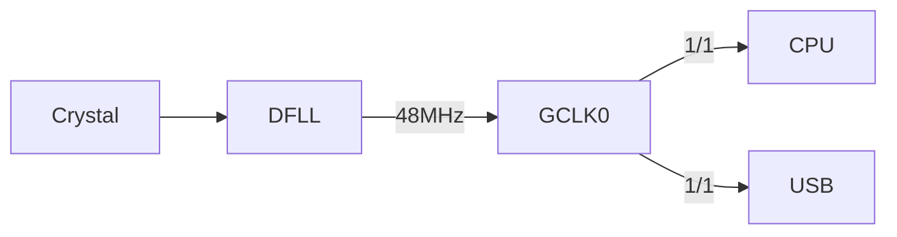
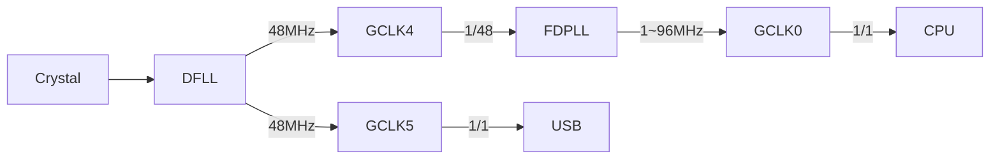
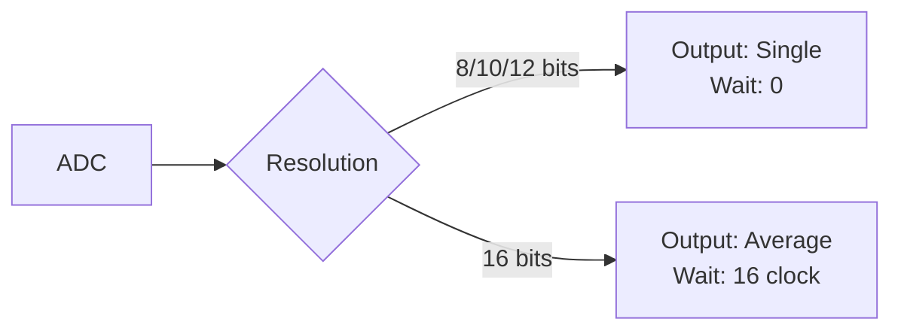

# **Arduino M0 Tweak**


Tweak the hardware behavior of SAMD21.
Easily hardware behavior tweak, such as CPU overclocking, ADC acceleration, etc.

# Example

```c++
m0tweak::m0cpu::setFrequency(72);
m0tweak::m0adc::setResolution(12);
```

# Details
The only export of this library will be [`arduino_m0_tweak.hpp`](./src/arduino_m0_tweak.hpp).
Other source files are for internal use and should not normally be include.

## OverClock
**!!CAUTION!! Overclocking should be performed at your own risk after fully understanding the risk.**
**I take no responsibility if the MCU burns or bricks.**

I tried simple serialport communication program on my board (Feather M0) and it worked up to 78 MHz, but when set it to 80 MHz the serialport connection broke.

The ATSAM series clock supply system is divided into 3 stages.

1. "Clock Source" that generates the clock.
2. "Clock Generator" that adjust (Prescale, etc.) the clock.
3. "Peripherals" that use clock.

<!-- WIP:START -->


### SysTick
Overclocking or underclocking can cause the SysTick timer to drift.

### ClockSource
There are total of 7 clock sources.
To operate the DFLL and FDPLL, must be input the clock from crystal oscillator or clock generator.

|ClockSource|Frequency|In/Ex|Description|
|:--|:--|:--|:--|
|OSC32K|32.768 KHz|Internal|RC oscillator|
|OSCULP32K|32.768 KHz|Internal|RC oscillator, ultra low power|
|OSC8M|8 MHz|Internal|RC oscillator|
|XOSC32K|32.768 KHz|External|Crystal oscillator|
|XOSC|0.4~32 MHz|External|Crystal oscillator|
|DFLL|48 MHz|Internal|FLL, Must be input the clock|
|FDPLL|0~96 MHz|Internal|PLL, Must be input the clock|

### ClockGenerator
There are total of 8 clock generators.
Some of which are preconfigured within the Arduino.

The GCLK1 input is XOSC32K when using the external oscillator and OSC32K when using the internal oscillator.

This is specified primarily at compile time with the `CRYSTALLESS` macro.

|ClockGenerator|Source|Usage|
|:--|:--|:--|
|GCLK0|DFLL|CPU, USB, and many other peripherals|
|GCLK1|OSC32K / XOSC32K|DFLL|
|GCLK2|OSCULP32K|WDT|
|GCLK3|OSC8M|-|
|GCLK4|-|-|
|GCLK5|-|-|
|GCLK6|-|-|
|GCLK7|-|-|

GCLK4/5 may already be used on boards with a special clock generation system, so there is no guarantee that it will work on all boards.
<!-- WIP:END -->

The SAMD21 uses clock source that always outputs 48MHz, usually called "DFLL", and clock generator called "GCLK0" to generate a 48MHz core clock.

SAMD21 also has clock source called "FDPLL" that can output any clock up to 96MHz, although it is not used in normal operation.

You can overclock up to 96MHz by changing the clock source used by the core clock on the sketch to FDPLL.

If only the clock source is changed, GCLK0 is still used as the clock generator, but GCLK0 is shared with various peripherals such as USB in addition to the core clock.

Set the peripheral to use different clock generator to prevent the peripheral from malfunctioning due to clock fluctuations on GCLK0.

In this library, executing the core clock setting function configures to use "GCLK5" as the clock generator for USB.

**Before**



**After**



## ADC
SAMD21 normally performs two consecutive 10 bits resolution samplings and returns the average value.

There is 31.5 clock wait between samples to get the average value.

As result, sampling may feel slower than other MCUs in many situations.

The hardware resolution of SAMD21 is 12 bits, but by using the average output, the resolution can be artificially increased to 16 bits.

This library provides function to set single output and no wait when the resolution is 8, 10, or 12 bits, and average output and set the wait to 16 clocks when the resolution is 16 bits.



# API
## `m0tweak::m0cpu::setFrequency(f)`
- Arguments
    - `f` : `uint8_t` ... CPU frequency.
- Result
    - `void`

Change the operating frequency of CPU.
Configurable range is `16` ~ `96` MHz in `1` MHz steps.

## `m0tweak::m0adc::setResolution(n)`
- Arguments
    - `n` : `uint8_t` ... Number of sampling bits.
- Result
    - `void`

Change the ADC sampling resolution.
Configurable value is `8` / `10` / `12` / `16` bits.

# Gratitude
This library is thanks to them, respectful.

- https://next-hack.com/index.php/2020/02/12/overclocking-an-arduino-zero-or-any-atsamd21
- https://synapse.kyoto/tips/AdcBooster/page001.html