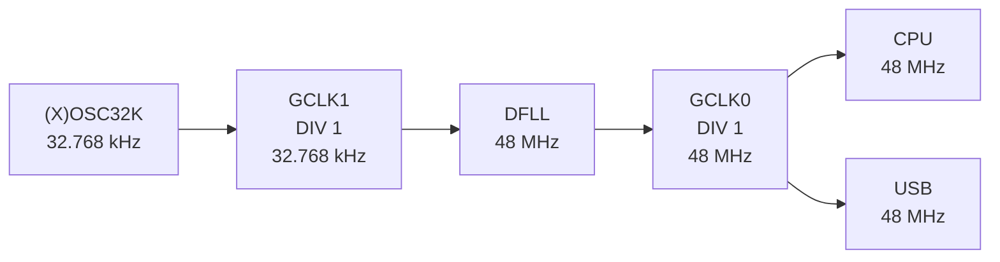
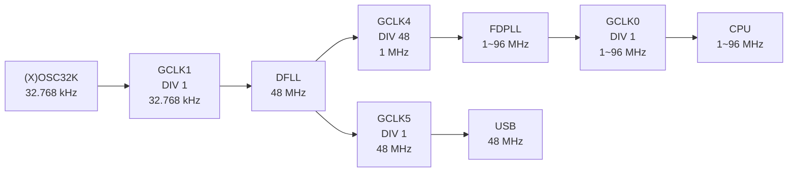
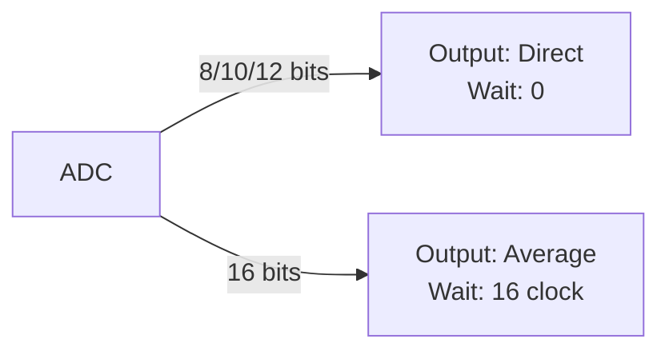

# **Arduino M0 Tweak**


Tweak the hardware behavior of SAMD21.
Easily hardware behavior tweak, such as CPU overclocking, ADC acceleration, etc.

# Example

```c++
m0tweak::cpuFrequency(72);
m0tweak::adcPrecision(12);
```

# Details
The only export of this library will be [`arduino_m0_tweak.hpp`](./src/arduino_m0_tweak.hpp).
Other source files are for internal use and should not normally be include.

# Overclock
**!!CAUTION!! Overclocking should be performed at your own risk after fully understanding the risk.**
**I take no responsibility if the MCU burns or bricks.**

I tried simple serialport communication program on my board ([Feather M0](https://www.adafruit.com/product/2772)) and it worked up to 78 MHz, but when set it to 80 MHz the serialport connection broke.

## Specification
First, the ATSAM series clock supply system is divided into 3 stages.

1. Clock Source
2. Clock Generator
3. Peripherals


### Clock Source
Consists of an oscillator and Locked-Loop.
There are total of 7 clock sources.

To operate the DFLL and FDPLL, must be input the clock from crystal oscillator or clock generator.

|Source|Frequency|In/Ex|Details|
|:--|:--|:--|:--|
|OSC32K|32.768 KHz|Internal|RC oscillator|
|OSCULP32K|32.768 KHz|Internal|RC oscillator, ultra low power|
|OSC8M|8 MHz|Internal|RC oscillator|
|XOSC32K|32.768 KHz|External|Crystal oscillator|
|XOSC|0.4~32 MHz|External|Crystal oscillator|
|DFLL|48 MHz|Internal|FLL, Must be input the clock|
|FDPLL|0~96 MHz|Internal|PLL, Must be input the clock|

### Clock Generator
Adjusts the clock such as frequency division and duty ratio stabilization.
There are total of 8 clock generators and each clock generator has no functional difference.

Some of the 8 clock generators are preconfigured internal the Arduino platform.

The GCLK1 input is XOSC32K when using the external oscillator and OSC32K when using the internal oscillator.
This is specified primarily at compile time with the `CRYSTALLESS` macro.

|Generator|Source|Divide|Frequency|Usage|
|:--|:--|:--|:--|:--|
|GCLK0|DFLL|1/1|48 MHz|CPU, USB, etc.|
|GCLK1|OSC32K / XOSC32K|1/1|32.768 kHz|DFLL|
|GCLK2|OSCULP32K|1/1|32.768 kHz|(WDT)|
|GCLK3|OSC8M|1/1|8 MHz|-|
|GCLK4|-|-|-|-|
|GCLK5|-|-|-|-|
|GCLK6|-|-|-|-|
|GCLK7|-|-|-|-|

<!-- ### SysTick
Overclocking or underclocking can cause the SysTick timer to drift. -->

### Peripherals
Components that actually use the generated clock such as CPU, ADC, and SERCOM.

## Mechanism
SAMD21 normally uses DFLL to provide the CPU clock via GCLK0.

So overclocking is possible by changing the GCLK0 clock source from DFLL that fixed 48MHz to FDPLL that can any frequency up to 96MHz.

The input clock for the FDPLL is preferably 1MHz and is generated by enabling GCLK4 which divides the DFLL by 48.

But there's problem with this.

Most peripherals are typically configured to use GCLK0 fixed at 48MHz for stable operation.

But by changing the GCLK0 clock source to FDPLL, the clock supplied to the peripheral will also fluctuate, resulting in unexpected malfunctions.

So to solve this problem, I enabled GCLK5, which uses DFLL, just like GCLK0 before the change.

When overclocking, it's recommended to change the clock generator used by the peripheral from GCLK0 to GCLK5.

This is especially essential for timing-sensitive peripherals such as USB.
(USB is set to use GCLK5 in the function)

### Before
|Generator|Source|Divide|Frequency|Usage|
|:--|:--|:--|:--|:--|
|GCLK0|DFLL|1/1|48 MHz|CPU, USB, etc.|
|GCLK1|OSC32K / XOSC32K|1/1|32.768 kHz|DFLL|
|GCLK2|OSCULP32K|1/1|32.768 kHz|(WDT)|
|GCLK3|OSC8M|1/1|8 MHz|-|
|GCLK4|-|-|-|-|
|GCLK5|-|-|-|-|
|GCLK6|-|-|-|-|
|GCLK7|-|-|-|-|



### After
|Generator|Source|Divide|Frequency|Usage|
|:--|:--|:--|:--|:--|
|GCLK0|FDPLL|1/1|1~96 MHz|CPU, etc.|
|GCLK1|OSC32K / XOSC32K|1/1|32.768 kHz|DFLL|
|GCLK2|OSCULP32K|1/1|32.768 kHz|(WDT)|
|GCLK3|OSC8M|1/1|8 MHz|-|
|GCLK4|DFLL|1/48|1 MHz|FDPLL|
|GCLK5|DFLL|1/1|48 MHz|USB, timing-sensitive peripherals|
|GCLK6|-|-|-|-|
|GCLK7|-|-|-|-|



# ADC
SAMD21 normally performs two consecutive 10 bits resolution samplings and returns the average value.

There's 31.5 clock wait between samples to get the average value.

As result, sampling may feel slower than other MCUs in many situations.

The hardware resolution of SAMD21 is 12 bits, but by using the average output, the resolution can be artificially increased to 16 bits.

This library provides function to set direct output and no wait when the resolution is 8, 10, or 12 bits, and average output and set the wait to 16 clocks when the resolution is 16 bits.



# API
## `m0tweak::cpuFrequency(f)`
- Arguments
    - `f` : `uint8_t` ... CPU frequency
- Result
    - `void`

Set the CPU frequency.
Configurable range is `1` ~ `96` MHz in `1` MHz steps.

## `m0tweak::adcPrecision(n)`
- Arguments
    - `n` : `uint8_t` ... Number of sampling resolution bits
- Result
    - `void`

Set the ADC sampling resolution.
Configurable value is `8` / `10` / `12` / `16` bits.

# Gratitude
This library is thanks to them, respectful.

- https://next-hack.com/index.php/2020/02/12/overclocking-an-arduino-zero-or-any-atsamd21
- https://synapse.kyoto/tips/AdcBooster/page001.html